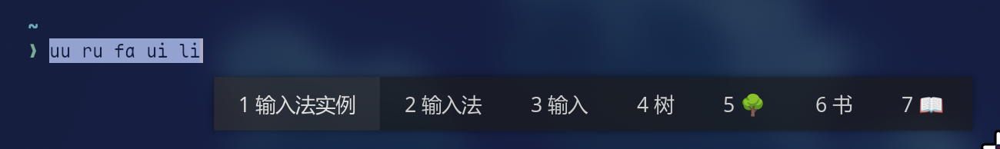

> 本文为[安装 Arch Linux 到移动硬盘上](./arch-install/)的后续应用安装、配置说明。

<!-- more -->

## 安装桌面环境或窗口管理器

流行的桌面环境有 [GNOME](https://wiki.archlinux.org/title/GNOME) 和 [KDE](https://wiki.archlinux.org/title/KDE)。

除此之外，还可以了解一下各种[窗口管理器](https://wiki.archlinux.org/title/Window_manager)。

平铺式窗口管理器：

- 窗口之间不会重叠，会自动分割并填充屏幕；
- 没有任务栏，全部使用虚拟桌面来管理/布局不同的窗口;
- 支持全键盘操作。

对于平铺式窗口管理器，推荐 [Hyprland](https://hypr.land/)。

2025年12月，笔者已经转到了 Niri。Niri 属于滚动式平铺窗口管理器。

一般的平铺式窗口管理器，窗口的打开和关闭尽管不会遮挡原有的窗口，但却会改变原有窗口的空间。如果希望旧窗口的大小不变，就要在新工作区创建。而工作区的增多，又会使得工作区的管理变得复杂。

比如，一项任务往往涉及几个工作区（浏览器、编辑器、终端），放在一个工作区太挤了。如果有多项并行的任务（不同的浏览器窗口、编辑器、终端），那么工作区之间就容易弄混，也不方便切换。

滚动式平铺窗口管理器不同，窗口的打开和关闭不会改变原有窗口的空间，一个工作区的大小也不再局限于屏幕的大小，而是一个左右无限延伸的平面。这意味着，一个任务的所有相关窗口都可以平铺的放置在同一个工作区。工作区之间的切换意味着任务的切换。

Niri 作者推荐的工作流是：

> 这就是我使用工作区的方式。
>
> 我通常会把浏览器放在最顶层的工作区，然后每个项目（或“事情”）对应一个工作区。每个工作区里我会打开一到两个刚好能容纳在显示器内的窗口，并经常切换它们。
>
> 另外，我可能还会滚动到屏幕外一些额外的窗口，这些窗口通常是我很少用到的，或者是我快速关闭的临时窗口。如果需要另一个常驻窗口，我会把它放在一个新的工作区里。
>
> 在工作过程中，我会经常上下移动工作区，以便一次性访问所需的内容。
> 例如，我经常需要在浏览器和当前正在处理的内容之间切换，所以我总是把当前正在处理的内容移动到浏览器的正下方，这样只需一次“聚焦-工作区上下移动”就能快速找到我想要的内容。

### Hyprland

之所以选择 [Hyprland](https://hypr.land/)，最重要的就是其**动画和视觉效果**，然后就是**丰富强大可配置选项**以及 **Wayland 原生支持**。

Hyprland 并非开箱即用，需要大量的配置，因此可以先使用大佬们的 [dotfiles](https://wiki.hypr.land/Getting-Started/Preconfigured-setups/)。

笔者使用过的有 [HyDE](https://github.com/HyDE-Project/HyDE)和 [end4's dotfiles](https://github.com/end-4/dots-hyprland)
安装这些 dotfiles 需要科学上网，否则可能导致部分资源因被墙而下载失败。

#### [HyDE](https://github.com/HyDE-Project/HyDE)

开箱即用，从 GRUB、SDDM 的主题的安装到 Shell、终端、浏览器的设定。甚至对于 NVIDIA 显卡用户，直接把显卡驱动和各种针对 NVIDIA 的各种设置都直接安装并设定好了。当然输入法还是要自己装。

丰富的主题，内置就有七八种主题，可以一键灵活切换。

使用 Waybar 因此组件的外观有些简陋。

#### [end4's dotfiles](https://github.com/end-4/dots-hyprland)

使用 Quick Shell，因此顶栏和其组件更美观，并且有 Dock 栏和左右侧边栏，以及虚拟桌面预览——实时的。

基于壁纸颜色自动设定主题颜色。

### Niri

安装指南见: <https://yalter.github.io/niri/Getting-Started.html>

```bash
sudo pacman -Syu niri
```

一些必要的组件:

```bash
sudo pacman xdg-desktop-portal-gnome xdg-desktop-portal-gtk gnome-keyring # Portals
sudo pacman -S xwayland-satellite # Xwayland
sudo pacman -S polkit-gnome # 身份认证
```

以及一些基本的应用：

```bash
sudo pacman -S alacritty fuzzel
sudo pacman -S mako # 一个轻量级通知 daemon
```

添加到 `~/.config/niri/config.kdl`，自动启动：

```kdl
spawn-at-startup "/usr/lib/polkit-gnome/polkit-gnome-authentication-agent-1"
spawn-at-startup "mako"
```

## 系统级设置

系统级设置为不在用户主目录下`~/`的配置。

### 设置 `timeshift` 快照

```bash
sudo pacman -S timeshift
sudo systemctl enable --now cronie # 启用Timeshift自动备份
```


**Tip**

如果安装 Hyprland 之后，如果遇到 timeshift GUI 无法启动的情况，需要安装 `xorg-xhost`。
原因见 [arch wiki](https://wiki.archlinux.org/title/Timeshift#Timeshift_GUI_not_launching_on_Wayland)
如果你使用 Niri，那么还需要另外安装一个 [polkit](https://wiki.archlinux.org/title/Polkit) agent，用于图形化身份认证。见<https://yalter.github.io/niri/Important-Software.html#authentication-agent>



使用方法可查阅[简明指南-系统快照（备份）与文件传输](https://arch.icekylin.online/guide/advanced/system-ctl#%E7%B3%BB%E7%BB%9F%E5%BF%AB%E7%85%A7-%E5%A4%87%E4%BB%BD-%E4%B8%8E%E6%96%87%E4%BB%B6%E4%BC%A0%E8%BE%93)。

### 改键

需求：

- `Esc`(Vim 用) 和 `Ctrl` 方便点击，保护小指头。
- 方向键（上下左右）和导航键（翻页、`home`、`end`）在主键盘区有快捷键，方便补全和搜索以及命令行的导航。

方案：

- `CapsLock` 单击为`Escape`
- `CapsLock` + `f,b,p,n,a,e,u,d` = `right`, `left`, `up`, `down`, `home`, `end`, `pageup`, `pagedown`
- `CapsLock` + `h,j,k,l` = `left`, `down`, `up`, `right`
- `Escape`为`CapsLock`
- 右`Ctrl`键与右`Alt`键互换，方便右手大拇指按 `Ctrl`

这里选用 [keyd](https://github.com/rvaiya/keyd) 来改键

安装并启用 keyd：

```bash
sudo pacman -S keyd
sudo systemctl enable --now keyd
```

要查看各个键位的名称，运行并按下要查看的键位：

```bash
sudo keyd monitor
```

添加配置文件 `/etc/keyd/default.conf`，如下所示：

```conf
[ids]

*

[main]

capslock = overload(capslock_layer, esc)
esc = capslock
rightalt = rightcontrol
rightshift = rightshift

[capslock_layer]
f = right
b = left
p = up
n = down
a = home
e = end
u = pageup
d = pagedown
h = left
j = down
k = up
l = right
space = backspace
backspace = delete
```

运行以下命令来重载配置：

```bash
sudo keyd reload
```

### GRUB 主题

这个仓库集成了许多好看的 GRUB 主题：<https://github.com/Jacksaur/Gorgeous-GRUB>

这里推荐 [Elegant-grub2-themes](https://github.com/vinceliuice/Elegant-grub2-themes)

#### Elegant-grub2-themes

从 `1f7907` 后，原有的 DejaVuSans 字体被替换成了 Grub 默认的 unifont 字体。为此你可能需要手动替换之前的字体，或使用在这之前的版本。

### SDDM

sddm 的配置文件路径可参考：<https://man.archlinux.org/man/sddm.conf.5>
，一般修改 `/etc/sddm.conf` 即可。

#### SDDM 主题

SDDM 主题可按自己的喜好下载。这里推荐 [SilentSDDM](https://github.com/uiriansan/SilentSDDM) 和 [sddm-astronaut-theme](https://github.com/Keyitdev/sddm-astronaut-theme)，里面集成许多主题，可以自行选择。

sddm 主题的目录基本都是 `/usr/share/sddm/themes/<theme-name>`，同样在这个目录里配置主题。

具体设置方法见对应主题的说明。

#### 设置 SDDM 触摸板轻触为点击

SDDM 默认运行在 Xorg 上，因此要修改 X11 的设置，详细见 [Arch Wiki--libinput](https://wiki.archlinux.org/title/Libinput#Via_Xorg_configuration_file)：

添加文件 `/etc/X11/xorg.conf.d/30-touchpad.conf` 并填入下面的内容：

```conf
Section "InputClass"
    Identifier "Custom Touchpad Settings"
    MatchIsTouchpad "on"
    Driver "libinput"

    # BEHAVIOR:
    Option "Tapping" "on"                # Tap to click
    Option "NaturalScrolling" "true"     # Invert scroll direction
    Option "ClickMethod" "clickfinger"   # 2-finger tap = right click, 3-finger tap = midle click
    Option "DisableWhileTyping" "true"   # Prevent accidents
EndSection
```

### 鼠标光标皮肤

推荐 [Bibata Cursor](https://github.com/ful1e5/Bibata_Cursor)

```bash
paru -S bibata-cursor-theme-bin
ls /usr/share/icons/ # 查看皮肤名称
```

#### SDDM 光标

在 `/etc/sddm.conf` 中添加：

```
[Theme]
CursorTheme=Bibata-Modern-Ice
```

如果不起作用，则可以选择直接修改全局默认光标 `/usr/share/icons/default/index.theme`：

```theme
[Icon Theme]
Inherits=Bibata-Modern-Ice
```

默认为：

```theme
[Icon Theme]
Inherits=Adwaita
```

#### Niri 光标

在 `~/.config/niri/config.kdl` 中添加：

```kdl
cursor {
    xcursor-theme "Bibata-Modern-Ice"

    hide-when-typing
    hide-after-inactive-ms 3000
}
```

### TODO: 休眠设置

修改 `/etc/mkinitcpio.conf`，在 `HOOKS()` 内添加 `resume`

```bash
sudo mkinitcpio -P # 重新生成 iniramfs
```

## 用户级设置

用户级的配置文件为用户主目录下的配置文件`~/`。
可在我的 [dotfiles](https://github.com/alyingfish/dotfiles) 中找到并同步——使用 [chezmoi](https://www.chezmoi.io/) 管理。时效以 dotfiles 中的文件最新。

下面的为部分设置的详细说明。

### 输入法

输入法和桌面环境/窗口管理器关联较大，这里的配置仅在 `Hyprland`、`Niri` 下测试过。

#### 安装输入法相关包

```bash
sudo pacman -S fcitx5-im # 输入法基础包组
sudo pacman -S fcitx5-chinese-addons # 官方中文输入引擎
sudo pacman -S fcitx5-configtool # 输入法设置工具
sudo pacman -S fcitx5-rime # 安装 rime 输入法
```

#### 添加环境变量

创建 `~/.config/environment.d/im.conf`，并添加(详细信息见 [fcitx5 in wayland](https://fcitx-im.org/wiki/Using_Fcitx_5_on_Wayland#Chromium_.2F_Electron))：

```conf
XMODIFIERS=@im=fcitx
QT_IM_MODULE=fcitx
SDL_IM_MODULE=fcitx
GLFW_IM_MODULE=ibus
INPUT_METHOD=fcitx
```

#### 启动fcitx5，安装rime输入法

```bash
fcitx5 -d # 启动fcitx5
```

在终端中运行 `fcitx5-configtool`（或者右键任务栏的输入法图标，点击 configure），打开设置界面，取消勾选 `Only Show Current Language`，在上方搜索 Rime 并将其移动到左侧，点击 `Apply` 并退出即可。

此时，使用 `Ctrl`+`Space` 即可切换输入法并能够输入中文。

第一次使用时，会自动生成 rime 配置文件，在 `~/.local/share/fcitx5/rime` 中。

#### 仅设置 `RightShift` 切换中英文输入法

我习惯仅使用 `RightShift` 切换输入法，这样不影响 `Shift` 输入大写。

`RightShift` 的按键默认识别为 `LeftShift`，因此还需要将 `RightShift` 改键为 "RightShift"，改键推荐使用 [keyd](https://github.com/rvaiya/keyd)。

将 `RightShift` 设置为 `Trigger Input Method` 即可。

#### 使用雾凇拼音词库

Rime 默认的中文输入是否简陋，这里推荐 [雾凇拼音](https://github.com/iDvel/rime-ice)。

```bash
paru -S rime-ice # 安装雾凇拼音输入方案

```

创建 `~/.local/share/fcitx5/rime/default.custom.yaml` 并添加：

```yaml
patch:
  # 仅使用「雾凇拼音」的默认配置，配置此行即可
  __include: rime_ice_suggestion:/
  # 以下根据自己所需自行定义
  __patch:
    menu/page_size: 7 #候选词个数
    schema_list: # 不使用小鹤双拼去掉下两行
      - schema: double_pinyin_flypy

  # 禁止`shift`切换Rime输入法中英文，仅通过切换输入法切换中英文，因为Rime输入法的中英文切换是全局的，而输入法是可以局限在应用的（一个应用对应一个输入法，对应是否中英文）
  ascii_composer/switch_key/Shift_L: noop
  ascii_composer/switch_key/Shift_R: noop
```

使用小鹤双拼的话，还需要添加小鹤双拼补丁，原因见：<https://github.com/iDvel/rime-ice/tree/main/others/%E5%8F%8C%E6%8B%BC%E8%A1%A5%E4%B8%81%E7%A4%BA%E4%BE%8B>

```double_pinyin_flypy.custom.yaml
# 这是小鹤的补丁，其他双拼将文件名前面那部分改成对应方案 ID 就可以了
patch:
  # （按需选择）清空 preedit_format 中的内容，输入时显示双拼编码
  translator/preedit_format: []
```

之后重新启动 fcitx5（右键图标点击 `restart`)，`Ctrl+Space` 即可输入中文。

记得设置自动启动，Hyprland 在 `~/.config/hypr/hyprland.conf` 中设置:

```conf
exec-once = fcitx5 --replace -d
```

#### 输入法美化

这里使用 fcitx5 的 [FluentDark](https://github.com/Reverier-Xu/Fluent-fcitx5) 皮肤，透明黑色。



安装：

```bash
# Dark theme
paru -S fcitx5-skin-fluentdark-git
# Light theme
paru -S fcitx5-skin-fluentlight-git
```

之后进入fcitx5-configtool，在 `Addons`-`UI`-`Classic User Interface` 中，在 `Theme` 和 `Dark Theme` 中下拉选中自己想要的主题即可。

### 字体

采用类苹果字体方案：

- 中文字体：苹方字体
- 英文字体：Inter
- 等宽字体：Maple Mono NF CN
- emoji：apple color emoji

`font.config`设置文件见 <https://github.com/wxmup/linux-fonts-from-apple?tab=readme-ov-file#readme>

我注释掉了其中的*渲染设置(字体微调)*，以避免分数缩放时 zen-browser 的部分字体模糊。

maple 字体 Github releases: <https://github.com/subframe7536/maple-font/releases>

```bash
sudo pacman -S inter-font ttf-nerd-fonts-symbols-mono 
paru -S otf-apple-pingfang ttf-apple-emoji ttf-maplemono-cn-unhinted ttf-maplemono-nf-cn-unhinted
```

### 动态壁纸

这里使用 [mpvpaper](https://github.com/GhostNaN/mpvpaper)，可以将视频作为桌面，并支持mpv的设置。

Archlinux 运行下面命令安装:

```bash
sudo pacman -S mpvpaper
```

#### mpvpaper 运行参数

运行命令为：

```conf
mpvpaper -f -n 7200 -o "input-ipc-server=/tmp/mpv-socket --shuffle --loop --loop-playlist --panscan=1.0 --osd-level=0" "*" /home/Videos/Wallpapers
```

参数解释:

mpvpaper 详细参数意义见 `man mpvpaper` ，mpv 详细设置见 <https://mpv.io/manual/master>

- `-f` -- fork mpvpaper 从而可以关闭终端
- `-n 7200` -- 幻灯片模式每2小时（7200秒）播放播放列表中的下一个视频，需配合 `--loop`, `--loop-playlist` 使用
- `-o` -- mpvpaper 传递参数给 mpv
  - `input-ipc-server=/tmp/mpv-socket` -- 提供 mpvpaper 的控制接口
  - `shuffle` -- 启动时打乱播放列表
  - `loop` -- 循环播放视频
  - `loop-playlist` -- 循环播放列表
  - `panscan=1.0` -- 拉伸以填充整个屏幕（不留黑边）
  - `osd-level=0` -- 去除所有 mpv 渲染在视频上的 OSD 信息，避免禁音 mpv 时显示 "Mute: yes"
- `"*"` -- 显示在所有屏幕上
- `/home/Video/Wallpapers` -- # 播放的可以是视频文件或者包含视频文件的文件夹

参数过多，可以设置 mpv 配置文件，再引用配置文件 `~/.config/mpv/mpv.conf` ，详细见 <https://mpv.io/manual/master/#configuration-files>：

```conf
[mpvpaper]
profile-desc="profile for mpvpaper"
vo=gpu-next
gpu-api=auto
hwdec=auto-safe
profile=fast
input-ipc-server=/tmp/mpv-socket
shuffle
loop
loop-playlist
panscan=1.0
osd-level=0
```

之后运行命令便可写为：

```conf
mpvpaper -f -n 7200 -o "profile=mpvpaper" "*" /home/Videos/Wallpapers
```

#### 控制 mpvpaper 命令

前提是已经设置了 `input-ipc-server=/tmp/mpv-socket` -- 提供 mpvpaper 的控制接口。并安装`socat`。

```conf
echo 'cycle mute' | socat - /tmp/mpv-socket # 静音/取消静音
echo 'playlist-prev' | socat - /tmp/mpv-socket # 播放上一个
echo 'cycle pause' | socat - /tmp/mpv-socket # 暂停/取消暂停
echo 'playlist-next' | socat - /tmp/mpv-socket # 播放下一个
```

### Zen Browser 设定

如果你喜欢垂直标签页，可以尝试一下 [Zen Browser](https://zen-browser.app/)，开源免费。

个人习惯最简化设置，能不动的就不动。

#### 添加 prime password

也适用于 firefox。为密码管理页面添加一个主密码。

见 <https://support.mozilla.org/en-US/kb/use-primary-password-protect-stored-logins>

#### 透明边栏

地址栏：`about:config`，`zen.widget.linux.transparency` 设置为 true，仅适用于 Linux 系统。

如果想要侧边栏（书签、历史）也透明，可以考虑安装 [Transparent Zen](https://zen-browser.app/mods/642854b5-88b4-4c40-b256-e035532109df/?q=transparen)

#### 去掉页面周围的间距

地址栏：`about:config`，`zen.theme.content-element-separation` 设置为 0。

#### 滚轮滑动切换标签页

`toolkit.tabbox.switchByScrolling` 设置为 true

#### RTX Video Super Resolution

支持与否见 <https://nvidia.custhelp.com/app/answers/detail/a_id/5448/~/rtx-video-faq> 的 COMPATIBILITY & BEHAVIOR

### nautilus 文件管理器

```bash
paru -S nautilus
sudo pacman -S ffmpegthumbnailer gvfs-smb nautilus-open-any-terminal file-roller gnome-keyring gst-plugins-base gst-plugins-good gst-libav
```

每个包具体作用见：<https://github.com/SHORiN-KiWATA/ShorinArchExperience-ArchlinuxGuide/wiki/%E5%AE%89%E8%A3%85Niri#nautilus>

### 终端

安装 ghostty 并设置 gnome 默认终端

```bash
paru -S ghostty
gsettings set org.gnome.desktop.default-applications.terminal exec 'ghostty'
gsettings set org.gnome.desktop.default-applications.terminal exec-arg '-e'
```

### 光污染

```bash
paru -S openrgb
```

## 遇到的 Bug 及其处置

### 小新 Pro 14 2023 EDID 错误

小新 Pro 14 2023 的 EDID 校验码错误，导致显示器帧率无法调至 120 Hz

详细解决方法可参考：<https://github.com/dgroenen/lenovo-ideapad-pro-5-14-14APH8-120hz-fix>

```bash
# 先下载修复后的 `edid-fixed.bin` 文件
sudo mkdir /lib/firmware/edid
sudo mv ~/Downloads/edid-fixed.bin /lib/firmware/edid/edid-fixed.bin
# 在 grub 里添加内核参数：drm.edid_firmware=eDP-1:edid/edid-fixed.bin
sudo nvim /etc/default/grub
```
