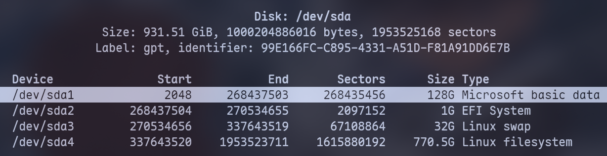

> 本文介绍了如何从已有的 Arch Linux 系统，在移动硬盘上安装一个新的 Arch Linux 系统。

<!-- more -->

为什么用 Archlinux？因为~~滚动更新、实用主义、丰富的 AUR 库、完善的 wiki、能学到东西~~可以装逼。


## Arch Linux 安装

### 硬件配置说明

- 1TB RC20 固态硬盘
- 10Gbps 硬盘盒
- 联想 小新 pro 14 —— CPU: AMD Ryzen 7 7840HS

### 安装前准备

因为是通过**已有的 Arch Linux 系统**，在移动硬盘上安装一个新的 Arch Linus 系统。因此需要安装 [arch-install-scripts](https://archlinux.org/packages/?name=arch-install-scripts) 和 [dosfstools](https://archlinux.org/packages/core/x86_64/dosfstools/) 这两个包。

如果要另外添加 exFAT 或 NTFS 分区的话，需要安装 [exfatprogs](https://archlinux.org/packages/extra/x86_64/exfatprogs/) 或 [ntfs-3g](https://wiki.archlinux.org/title/NTFS-3G)。


**Tip**

也可以选择通过最新发布的 [Arch Linux 安装镜像](https://archlinux.org/download/)来安装 Arch Linux。
具体安装步骤可参考 [archlinux 简明指南](https://arch.icekylin.online/)：[通过U盘安装](https://arch.icekylin.online/guide/rookie/pre-install.html)及[通过虚拟机安装](https://arch.icekylin.online/guide/rookie/pre-virt.html)
Arch Linux 安装镜像自带 `arch-install-scripts` 包，因此无须安装该包。
但镜像系统需要配置网络、时钟、镜像源等。



**Tip**

[arch-install-scripts](https://archlinux.org/packages/?name=arch-install-scripts) 这个包里面是一些安装 Arch Linux 必须要用到的命令，如 `pacstrap` 和 `arch-chroot`
[dosfstools](https://archlinux.org/packages/core/x86_64/dosfstools/)，这个包是一些格式化分区的命令，如：`mkfs.fat`。
[ntfs-3g](https://wiki.archlinux.org/title/NTFS-3G)，包含用于格式化 Windows 的 NTFS 分区的命令。
[exfatprogs](https://archlinux.org/packages/extra/x86_64/exfatprogs/), 包含用于格式化 exFAT 分区的命令。


运行下面的命令，以更新系统并安装 `arch-install-scripts` 和 `dosfstools` 以及 `ntfs-3g` `exfatprogs`:

```bash
sudo pacman -Syu
sudo pacman -S arch-install-scripts dosfstools ntfs-3g exfatprogs
```

最后，将移动硬盘装入硬盘盒并接入电脑，运行 `sudo fdisk -l` 查看硬盘分区情况，确定系统已识别到硬盘（一般为 `/dev/sda`）。

### 分区格式化

首先，切换到最高权限账户 `root`，接下来的操作需要 `root` 权限。

```bash
su
```

#### 分区

之后运行 `cfdisk` 开始分区，cfdisk 的使用，见 [archlinux 简明指南中的介绍](https://arch.icekylin.online/guide/rookie/basic-install.html#_7-1-%E5%88%86%E5%8C%BA)：

```bash
cfdisk /dev/sda # 安装 archlinux 的磁盘分区
```

这里这里按[官方安装指南的提示](https://wiki.archlinux.org/title/Install_Arch_Linux_on_a_removable_medium#Installation_tweaks)，增加了一个 128G 大小的 ntfs 或 exFAT 分区。

这样一来，这个安装了 Arch Linux 系统的移动硬盘仍然可以作为一个 128G 的**移动硬盘**使用。为避免可能无法识别该分区，将其设在第一个分区。



这里使用 [Btrfs 文件系统](https://arch.icekylin.online/guide/rookie/basic-install-detail.html#%F0%9F%92%BE-%E4%B8%BA%E4%BB%80%E4%B9%88%E8%A6%81%E7%94%A8-btrfs-%E6%96%87%E4%BB%B6%E7%B3%BB%E7%BB%9F)，因此 `/home/` 和 `/` 都在一个分区上 `/dev/sda4`。

最后，运行 `fdisk -l` 查看硬盘分区情况。

#### 格式化

运行下面命令，格式化分区，注意将各个分区名替换成你对应的分区：

```bash
mkfs.exfat -L mySSD /dev/sda1 # 格式化exFAT分区
mkfs.fat -F 32 /dev/sda2 # 格式化EFI分区，双系统注意不要运行这步
mkswap /dev/sda3 # 格式化Swap分区
mkfs.btrfs -L myArch /dev/sda4 # 格式化Btrfs分区
mount -t btrfs -o compress=zstd /dev/sda4 /mnt # 挂载Btrfs分区
df -h # 复查挂载情况
btrfs subvolume create /mnt/@ # 创建 / 目录子卷
btrfs subvolume create /mnt/@home # 创建 /home 目录子卷
btrfs subvolume list -p /mnt # 查看子卷情况
umount /mnt
```

### 挂载分区

对硬盘分区并格式化后，就可以安装系统了。但在这之前，要先将分区挂载在系统的文件目录上，这样才能对其进行读写操作。

运行下面命令，挂载分区到 `/mnt` 目录下，`--mkdir` 参数在挂载目录不存在时自动创建该目录：

```bash
mount -t btrfs -o subvol=/@,compress=zstd /dev/sda4 /mnt # 挂载 / 到 /mnt
mount --mkdir -t btrfs -o subvol=/@home,compress=zstd /dev/sda4 /mnt/home # 挂载 /home 到 /mnt/home 
mount --mkdir /dev/sda2 /mnt/boot # 挂载 /boot 到 /mnt/boot
mount --mkdir -t exfat /dev/sda1 /mnt/media/mySSD # 挂载exFAT数据分区，用于生成fstab后自动挂载
swapon /dev/sda3 # 启用交换分区
```

因为我用于安装 Arch Linux 的系统本身有并启用了一个 swap 分区，因此还要把这个用于安装的系统的 swap 分区取消挂载，否则生成 fstab 文件时会把这个分区也加进去。

```bash
swapoff /dev/nvme0n1p6 # 取消原系统swap分区
```

运行下面命令以查看挂载结果：

```bash
df -h # 查看分区结果
free -h # 查看swap
```

### 安装系统

现在正式开始安装系统，因为是从已有的 Arch Linux 上安装 Arch Linux，因此加上 `-c` 参数，使用本地的缓存，避免重新下载包：

```bash
pacstrap -c /mnt base base-devel linux linux-firmware btrfs-progs
# 因为使用btrfs文件系统，额外安装一个btrfs-progs包
pacstrap -c /mnt amd-ucode intel-ucode # 移动硬盘跨平台，因此都AMD和intel的微码都装上
pacstrap -c /mnt networkmanager bluez bluez-utils # 网络, 蓝牙
pacstrap -c /mnt nvim sudo fish man-db man-pages texinfo # 编辑器等
```

### 生成 fstab 文件

Linux 根据 fstab 文件来在启动时自动挂载分区。

`genfstab` 将当前挂载情况生成并写入到 `fstab` 文件，以确保安装后的系统能够正确挂载分区。

```bash
genfstab -U /mnt >> /mnt/etc/fstab # 生成fstab文件
nvim /mnt/etc/fstab # 查看并修改fstab文件
```

修改 /dev/sda1 分区的选项如下所示，以确保该分区用户具有读/写权限：

```fstab
UUID=YOUR_DRIVE_UUID /media/mySSD exfat defaults,nofail,uid=1000,gid=1000,umask=000 0 0
```


**注意**

如果使用 [Timeshift](https://wiki.archlinux.org/title/Timeshift) 来备份/还原系统。
在生成的 fstab 文件中，如果有 subvolid 参数，需要移除 btrfs 分区中两个子卷的 subvolid 参数，避免 Timeshift 恢复 Btrfs 快照时，可能出现由于子卷 ID 变更导致无法挂载目录而无法进入系统。


### 系统基本设置

现在，新系统的 Linux 内核、基本的软件和驱动已经安装完成了。`fstab` 文件也已生成，现在我们切换到新系统中，并完成新系统的一些基本设置。

运行下面的命令，以切换到新系统中。

```bash
arch-chroot /mnt
```

此处设置主要参照 [archlinux 简明指南](https://arch.icekylin.online/)，这里仅记录执行过的命令。

#### 设置主机名与时区

```bash
echo "myArch" > /etc/hostname # 添加主机名，这里是myArch
```

设置 `hosts` 文件：

```bash
nvim /etc/hosts
```

加入下面内容，注意要和主机名一致：

```
127.0.0.1   localhost
::1         localhost
127.0.1.1   myArch.localdomain myArch
```

```bash
ln -sf /usr/share/zoneinfo/Asia/Shanghai /etc/localtime # 设置时区
hwclock --systohc # 同步硬件时间，此命令假定硬件时钟已设置为 UTC
```

#### 设置 Locale

`Locale` 决定了软件使用的语言、书写习惯和字符集。

```bash
nvim /etc/locale.gen # 去掉注释 en_US.UTF-8 UTF-8 以及 zh_CN.UTF-8 UTF-8
locale-gen
echo 'LANG=en_US.UTF-8' > /etc/locale.conf # 设置系统语言
```

#### 设置 root 密码

```bash
passwd root
```

#### 创建新的 Initramfs

按 [Install Arch Linux on a removable medium](https://wiki.archlinux.org/title/Install_Arch_Linux_on_a_removable_medium) 的要求，需要修改 `/etc/mkinitcpio.conf` 文件：

> 在创建初始 RAM 磁盘之前，请在 /etc/mkinitcpio.conf 中将 block 和 keyboard 钩子移到 autodetect 钩子之前。
> 此操作是必要的，以便能够在多个系统上启动，每个系统在早期用户空间中都需要不同的模块。

```bash
vim /etc/mkinitcpio.conf
```

在`HOOKS`中将`block`和`keyboard`移到`autodetect`之前：

```
HOOKS=(base udev keyboard block autodetect microcode modconf kms keymap consolefont filesystems fsck)
```

然后运行：

```bash
mkinitcpio -P
```

### 安装启动加载程序

[启动加载程序](https://wiki.archlinux.org/title/Arch_boot_process#Boot_loader)和主板固件（BIOS 或 UEFI）打交道。

它从固件中获取控制权，然后将操作系统（Linux 内核）加载到内存中，以便系统开始运行。

Linux 上最常用的启动加载程序是 [GRUB](https://wiki.archlinux.org/title/GRUB)。

#### 安装 GRUB

如果想要 GRUB 同时可以启动 Windows 系统，需要另外安装 `os-prober` 包，并在之后的设置中添加：`GRUB_DISABLE_OS_PROBER=false`

```bash
pacman -S grub efibootmgr os-prober # 前两个是GRUB必需的，os-prober用于引导windows系统
```

根据 [Install Arch Linux on a removable medium 的要求](https://wiki.archlinux.org/title/Install_Arch_Linux_on_a_removable_medium#GRUB)，
加上 `--removable` 参数以保证将硬盘移至另一台计算机时能够从移动硬盘启动：

```bash
grub-install --target=x86_64-efi --efi-directory=/boot --removable --recheck
```

#### 修改并生成 GRUB 配置文件

接下来修改 `/etc/default/grub` 文件，并生成配置：

进行如下修改：

- 去掉 GRUB_CMDLINE_LINUX_DEFAULT 一行中最后的 quiet 参数
- 把 loglevel 的数值从 3 改成 5。这样是为了后续如果出现系统错误，方便排错
- 加入 nowatchdog 参数，这可以显著提高开关机速度
- 添加/取消这一行的注释：GRUB_DISABLE_OS_PROBER=false，启用 os-prober

```bash
nvim /etc/default/grub
grub-mkconfig -o /boot/grub/grub.cfg
```


**注意**

若 Windows 安装在另一个硬盘中则现在不会被检测到, 可在重新进入系统后并再次执行 `grub-mkconfig -o /boot/grub/grub.cfg`


### 安装完成

恭喜你，一个基本的 Arch Linux 系统已安装完成，现在可以重新登录到新系统，并完成另外的配置和安装。

```bash
exit # 退回安装环境
umount -R /mnt # 卸载新分区
reboot # 重启
```

记得按 `F2` 或者其它键，设置主板从安装了新系统的硬盘启动。

## Arch Linux 配置

重启并使用 `root` 账户登录。

### 基础设置

此处设置主要参照 [archlinux 简明指南](https://arch.icekylin.online/)，这里仅记录执行过的命令。

#### 连接网络

```bash
systemctl enable --now NetworkManager
# 如果使用WiFi，运行以下命令
nmcli dev wifi list
nmcli dev wifi connect <wifi SSID> --ask
ping www.bilibili.com # 测试网络连接
```

#### 准备普通用户

```bash
useradd -m -G wheel -s /bin/bash myusername # 创建用户及用户家目录
passwd myusername # 设置密码
EDITOR=nvim visudo # 启用用户组权限，注释掉这一行：#%wheel ALL=(ALL:ALL) ALL
```

#### 用户设置

更改默认编辑器，在 `/root/.bash_profile` 及 `/home/myusername/.bash_profile` 中加入：

```
export EDITOR='nvim'
```

更改默认 shell:

```bash
su myusername # 切换用户
chsh -l # 查看安装了哪些 Shell
chsh -s /usr/bin/fish # 修改当前账户的默认 Shell 为fish
```

#### 开启 32 位支持库与 Arch Linux 中文社区仓库

修改 `/etc/pacman.conf`：

取消下面两行的注释：

```conf
#[multilib]
#Include = /etc/pacman.d/mirrorlist
```

并添加：

```conf
[archlinuxcn]
Server = https://mirrors.ustc.edu.cn/archlinuxcn/$arch # 中国科学技术大学开源镜像站
Server = https://mirrors.tuna.tsinghua.edu.cn/archlinuxcn/$arch # 清华大学开源软件镜像站
Server = https://mirrors.hit.edu.cn/archlinuxcn/$arch # 哈尔滨工业大学开源镜像站
Server = https://repo.huaweicloud.com/archlinuxcn/$arch # 华为开源镜像站
```

#### 更新`pacman`数据库，安装一些基础功能包

```bash
sudo pacman -Syyu
sudo pacman -S sof-firmware alsa-firmware alsa-ucm-conf # 声音固件
sudo pacman -S adobe-source-han-serif-cn-fonts wqy-zenhei # 安装几个开源中文字体。一般装上文泉驿就能解决大多 wine 应用中文方块的问题
sudo pacman -S noto-fonts noto-fonts-cjk noto-fonts-emoji noto-fonts-extra # 安装谷歌开源字体及表情
sudo pacman -S archlinuxcn-keyring # cn 源中的签名（archlinuxcn-keyring 在 archlinuxcn）
sudo pacman -S paru
paru -S ttf-ms-win11-auto-zh_cn # 微软字体
```

`archlinuxcn-keyring` 可能会报错，解决方法请查阅：<https://www.archlinuxcn.org/archlinuxcn-keyring-manually-trust-farseerfc-key/>

安装并启用蓝牙服务

```bash
sudo pacman -S bluez bluez-utils
sudo systemctl enable --now bluetooth # 启用蓝牙服务
```

### 设置 `timeshift` 快照

建议在安装驱动前备份。

```bash
sudo pacman -S timeshift
sudo systemctl enable --now cronie # 启用Timeshift自动备份
```

因为还没有安装桌面环境/窗口管理器，需要手动设置 timeshift。

也可以在选择先安装一个临时的桌面环境，设置好 timeshift 备份后，再安装显卡驱动。timeshift 图形界面的设置可参考[简明指南](hitps://arch.icekylin.online/guide/rookie/desktop-env-and-app.html#_12-%E8%AE%BE%E7%BD%AE-timeshift-%E5%BF%AB%E7%85%A7)。

修改 `/etc/timeshift/timeshift.json` 如下，UUID 通过运行 `blkid` 来查看。

```json
{
  "backup_device_uuid" : "21b2199f-38e4-4bf1-ae1e-0c9d4d0431f8",
  "parent_device_uuid" : "",
  "do_first_run" : "false",
  "btrfs_mode" : "true",
  "include_btrfs_home_for_backup" : "true",
  "include_btrfs_home_for_restore" : "true",
  "stop_cron_emails" : "true",
  "schedule_monthly" : "false",
  "schedule_weekly" : "false",
  "schedule_daily" : "true",
  "schedule_hourly" : "false",
  "schedule_boot" : "false",
  "count_monthly" : "2",
  "count_weekly" : "3",
  "count_daily" : "5",
  "count_hourly" : "6",
  "count_boot" : "5",
  "snapshot_size" : "0",
  "snapshot_count" : "0",
  "date_format" : "%Y-%m-%d %H:%M:%S",
  "exclude" : [],
  "exclude-apps" : []
}
```


**Tip**

如果安装 Hyprland 之后，如果遇到 timeshift GUI 无法启动的情况，需要安装 `xorg-xhost`。
原因见 [arch wiki](https://wiki.archlinux.org/title/Timeshift#Timeshift_GUI_not_launching_on_Wayland)


这里先用命令行启用备份：

```bash
timeshift --list # 查看快照
timeshift --create --comments "after install" --tags D # 创建快照，标签为每日
# timeshift  --restore  --snapshot '2014-10-12_16-29-08' --skip-grub # 恢复指定快照，并跳过grub
```

使用方法可查阅[简明指南-系统快照（备份）与文件传输](https://arch.icekylin.online/guide/advanced/system-ctl#%E7%B3%BB%E7%BB%9F%E5%BF%AB%E7%85%A7-%E5%A4%87%E4%BB%BD-%E4%B8%8E%E6%96%87%E4%BB%B6%E4%BC%A0%E8%BE%93)。

### 安装显卡驱动

因为是移动硬盘，且笔者使用的机器是 `Intel 核显` + `NVIDIA 独显` 以及 `AMD 核显笔记本`，我安装的是：

```bash
sudo pacman -S mesa lib32-mesa vulkan-intel lib32-vulkan-intel # Intel 核芯显卡
sudo pacman -S mesa lib32-mesa xf86-video-amdgpu vulkan-radeon lib32-vulkan-radeon #AMD 集成显卡
sudo pacman -S nvidia-open nvidia-settings nvidia-utils lib32-nvidia-utils # NVIDIA 独立显卡
```


**注意**

[Arch Wiki 提示](https://wiki.archlinux.org/title/NVIDIA)：nvidia-utils 软件包包含一个文件，该文件会在您重启后将 nouveau 模块列入黑名单。您也可以选择从 /etc/mkinitcpio.conf 中的 HOOKS 数组中移除 kms ，并重新生成 initramfs 。这将阻止 initramfs 包含 nouveau 模块，确保内核在启动初期无法加载它。

在 `/etc/mkinitcpio.conf` 文件 `HOOKS` 中，删除 `kms`

```conf
HOOKS=(base udev keyboard block autodetect microcode modconf keymap consolefont filesystems fsck)
```

然后运行：

```bash
sudo mkinitcpio -P
```




**注意**

对于 Wayland，Nvidia 还需要设置 [DRM 内核级显示模式设置](https://wiki.archlinuxcn.org/wiki/Wayland#%E7%B3%BB%E7%BB%9F%E9%9C%80%E6%B1%82)，不然可能会导致黑屏

添加[环境变量](https://wiki.archlinuxcn.org/wiki/%E7%8E%AF%E5%A2%83%E5%8F%98%E9%87%8F)，在 `/etc/environment` 中或 `~/.config/environment.d/nvidia.conf` 添加:

```text
GBM_BACKEND=nvidia-drm
__GLX_VENDOR_LIBRARY_NAME=nvidia
LIBVA_DRIVER_NAME=nvidia
```


